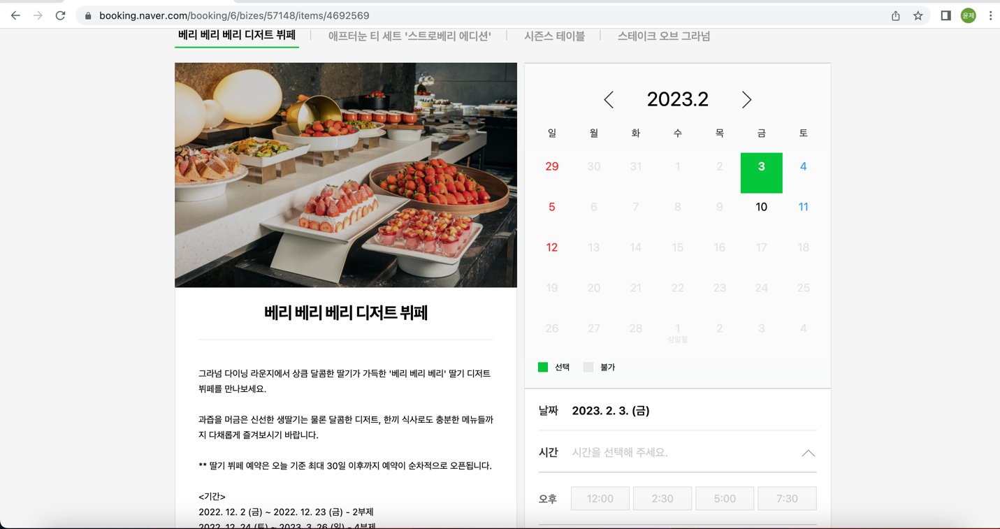

## 네이버 예약 모니터링 (파이썬 스크립트)  
개인적 필요에 의해 개발한 네이버 예약 모니터링 스크립트입니다.
  
맛집, 콘서트 등 네이버 예약서비스를 통해 제공되는 상품이 원하는 기간 중 예약 가능한 상태가 되면.  
알림메시지를 SMS로 발송합니다.  

* bookingNaver.py:
  * 상품의 startDate ~ endDate 기간 중 예약 가능한 시간대가 있는지 확인하여 줍니다.
* sms.py: (Optional)
  * SMS 발송을 위해 Naver Cloud 'Simple & Easy Notification Service'를 이용하였습니다.
  * 액세스키, 시크릿키, 서비스ID, SMS발신번호를 환경변수로 제공해야 합니다. 
  * 해당 서비스를 이용하지 않는다면, SMS 발송 기능만 다른 방법으로 커스터마이징하여 사용하면 됩니다.

본 스크립트는 개인적으로 사용할 용도로 만들었으며.  
사용 중 발생한 문제에 대해 책임을 지지 않습니다.